# music-synthesizer
Homework No.1 for summer course: MATLAB

# 合成音乐-初级

## 简谱入门

### 定调


以上图为例, `1=F`表示该歌曲为**F调**, 根据下图音名与频率的对应关系, 


可知该简谱中各唱名对应的音名及频率如下表: 

|唱名|音名|频率(Hz)|频率变化(f<sub>i</sub>/f<sub>i-1</sub>)|
|:--:|:--:|:--:|:--:|
|1|F|349.23|/|
|2|G|392.00|1.1225|
|3|A|440.00|1.1225|
|4|<sup>♭</sup>B or <sup>♯</sup>A|466.16|1.0595|
|5|C|523.25|1.1225|
|6|D|587.33|1.1225|
|7|E|659.26|1.1225|
|高音1|F|698.46|1.0595|

对应时要注意3和4, 7和高音1之间是**半音**关系, 即频率比例为2<sup>1/12</sup>, 其余相邻音之间为全音关系, 即频率比例为2<sup>2/12</sup>

另外注意到高音1的频率是1频率的两倍, 即高了一个八度.

- 创建[src/freqmap.m](src/freqmap.m)函数实现计算给定调给定音频率的功能

    ```matlab
    >> help freqmap
      freqmap(key, nnote)
      输入:
      <string> key: 调名
      <int> nnote: 数字简谱
      返回值:
      <float> f: 该音在给定调下的频率
     
      e.g. 求 F大调 So(5)音 的频率
      freqmap('F',5)
                = 523.2511
     
      
      freqmap(key, nnote, flag)
      输入:
      <int> flag: -1表示降调(b), 1表示升调(#)
     
      e.g. 求 bD调 La(6)音 的频率
      freqmap('D',6,-1)
                = 466.1638
    ```

    ```matlab
    >> freqmap('F',1)  % 求F调Do的频率

    ans =

      349.2282
    ```

    - *注: 输入参数nnote=0表示低音7, 而非休止符, 输入参数nnote=8表示高音1, 以此类推*


### 节拍, 时值, 停顿

#### 节拍

- `BPM`: Beats Per Minute, 歌曲每分钟的节拍数, 歌曲*东方红*的`BPM=140`, 因此一拍的时间大约为`60/140=0.43`秒

- 节奏: 分母`m`表示以一个`m`分音符为一拍, 分子`n`表示一小节有`n`拍

    

    如东方红为四二拍, 一个四分音符为一拍, 一小节两拍

#### 时值(音符的持续时间)

- 增时线: 时值增加一拍

    

    上图中的2音持续两拍

- 减时线: 时值减半

    

    上图中的5和6的时值均为半拍

- 附点: 时值增加原来的一半, 即时值*1.5

#### 停顿

- 简谱中用0表示休止符, 即无声的音符, 其时值规则同上


## 用数据表示简谱


```matlab
BPM = 140;
key = 'F';
song = [5, 1;       % 将一段乐谱表示为一个n-by-2矩阵
        5, 0.5;     % 第一列表示各音符的唱名
        6, 0.5;     % 注意0表示低音7, -1表示低音6, 以此类推
        2, 2;       % 休止符用-inf表示
        1, 1;       % 第二列表示各音符的时值, 单位为拍
        1, 0.5;
        -1, 0.5;
        2, 2];
```

- 给定了简谱的数据结构, 构建`src/soundsong.m`进行**初级音乐合成**

    ```matlab
    % src/soundsong.m

    function wav = soundsong(BPM,key,flag,song,fs)
    % soundsong(BPM,key,song,fs)
    % 输入:
    %   <float> BPM: beats per minute
    %   <char> key: 歌曲的调
    %   <int> flag: -1表示降半个音阶(♭), 1表示升半个音阶(♯)
    %   <n-by-2 matrix> song: 乐谱, 第一列为音符唱名, 第二列为各音符持续拍数
    %       休止符用-inf表示
    %   <float> fs: 采样频率
    % 返回值:
    %   <row vector> wav: 合成的歌曲

    tpb = 60/BPM;   % time per beat (seconds)
    wav = [];       % intialize wav
    for i = 1:size(song,1)
        t = 0:1/fs:(tpb*song(i,2));     % time sequence
        if song(i,1) == -inf
            wav = [wav, zeros(1,length(t))];
        else
            wav = [wav, sin(2*pi*freqmap(key,song(i,1),flag)*t)];
        end
    end

    sound(wav,fs);

    end
    ```

    ```matlab
    >> soundsong(140,'F',0,song,fs);
    >> soundsong(120,'F',0,song,fs);
    >> soundsong(120,'C',0,song,fs);
    ```

    如上, 即可用单频信号合成音乐, 可以调节节奏快慢, 基调

    **注: 将`soundsong.m`中的`sin`函数换成`sawtooth`, `square`等函数会听到不同音色的音乐, 因为锯齿波和方波含有不同的谐波分量, 改变了音色**


## ADSR包络控制<sup>[1]</sup>


- 起音(Attack): 控制最初从零振幅到最大振幅的时间

- 衰减(Decay): 控制从最大振幅降到延音电平的时间

- 延音(Sustain): 设定按住某个键时生成的稳定振幅电平(延音电平)

- 释音(Release): 控制键释放后, 从延音电平降至零振幅的时间

*注: 如果在起音或衰减阶段释放键，则通常会跳过延音阶段。延音电平为零会产生类似钢琴声或打击乐的包络，没有持续稳定的电平，即使按住键时也如此。*

**根据人耳特性, 采用指数衰减的包络进行调制**

```matlab
function wav = adsr(attack,decay,sustain,release,wavin,t)
%wav = adsr(attack,decay,sustain,release,generator,t)
% 输入:
%   <float> attack: 冲激时间所占比例
%   <float> decay: 衰减时间所占比例
%   <float> sustain: 延音电平归一化振幅(最大振幅为1)
%   <float> release: 释放时间所占比例
%   <string> generator: 'sin', 'sawtooth', 'square'
%   <row vector> t: 时间序列
%   <float> f: 频率
% 返回值:
%   <row vector> wav: 包络调制后的波形

N = length(t);
ta = t(1:floor(attack*N));     % time sequence for Attack
td = t(floor(attack*N)+1:floor((attack+decay)*N));    % time sequence for Decay
tr = t(floor((1-release)*N)+1:end);    % time sequence for Release

wa = wavin(1:floor(attack*N));
wd = wavin(floor(attack*N)+1:floor((attack+decay)*N));
ws = wavin(floor((attack+decay)*N)+1:floor((1-release)*N));
wr = wavin(floor((1-release)*N)+1:end);

ea = (1-10.^(-ta))/(1-10.^(-ta(end)));    % envelope for Attack
ed = (1-sustain)*(exp(-(td-td(end)))-1)/(exp(-(td(1)-td(end)))-1)+sustain;  % envelope for Decay
es = sustain;            % envelope for Sustain
er = sustain*...
    (10.^(sustain-(tr-tr(1))/(tr(end)-tr(1))*sustain)-1)/...
    (10.^sustain-1);    % envelope for Release

wav = [ea.*wa, ed.*wd, es.*ws, er.*wr];

end
```

经过参数的测试, 确定了指数衰减系数(事实上不同底数差别不大), 典型的ADSR参数调制出的单音波形如下:

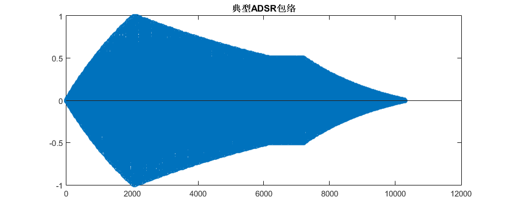

对应于**指数衰减ADSR模型**

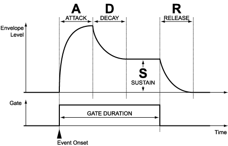

即将输入音乐分段调制后再输出, 包络形状由ADSR四个参数控制, 对于单频信号, ADSR对其音色的影响如下:

|起音A|衰减D|延音S|释放R|音色|
|:---:|:---:|:---:|:---:|:--:|
|0.9|0.05|0.0001|0.05|管乐|
|0.05|0.9|0.0001|0.05|钢琴|
|0.05|0.05|0.0001|0.9|电话按键音|
|0.05|0.05|0.05|0.05|拨弦音|
|0.05|0.25|0.15|0.15|木琴|


## 变调

- 升一个八度

    - 方法一: **改谱子**

        将原谱中的每个音提高一个八度, 对应到矩阵中即第一列的元素+7, 第二列保持不变: 

        ```matlab
        >> ChinaRed

        ChinaRed =

            5.0000    1.0000
            5.0000    0.5000
            6.0000    0.5000
            2.0000    2.0000
            1.0000    1.0000
            1.0000    0.5000
           -1.0000    0.5000
            2.0000    2.0000

        >> HighChinaRed = [ChinaRed(:,1)+7,ChinaRed(:,2)]

        HighChinaRed =

           12.0000    1.0000
           12.0000    0.5000
           13.0000    0.5000
            9.0000    2.0000
            8.0000    1.0000
            8.0000    0.5000
            6.0000    0.5000
            9.0000    2.0000

        >> wav = soundsong(140,'F',0,ChinaRed,fs,adsr);         % 原调
        >> wav1 = soundsong(140,'F',0,HighChinaRed,fs,adsr);    % 升一个八度
        ```

    - 方法二: **重新采样**

        升高一个八度即将频率变为原来的两倍, 可用`resample`函数将采样率降为原来的一半, 再以原采样率调用`sound`, 频率即变为原来的两倍, 但音乐的时长会变化

        ```matlab
        >> wav2 = resample(wav,1,2);
        >> sound(wav2,fs);
        ```

    - 对比两种方法, 产生的音乐音调相同, 但方法二产生的音乐在时间上被压缩了

- 降一个八度

    - 方法一: **改谱子**

        ```matlab
        >> LowChinaRed = [ChinaRed(:,1)-7,ChinaRed(:,2)];
        >> wav1 = soundsong(140,'F',0,LowChinaRed,fs,adsr);
        ```

    - 方法二: **重新采样**

        ```matlab
        >> wav2 = interp(wav,2);    % 以原采样率的两倍重新进行线性插值采样
        >> sound(wav2,fs);
        ```

    - 两方法音调相同, 但方法二产生的音乐在时间上被拉长了

- 升半个音阶

    - 方法一: **改曲调**

        注意到`soundsong`函数提供了`flag`参数用以调整音阶, F调升半个音阶成为<sup>♯</sup>F调(<sup>♭</sup>G调)

        ```matlab
        >> wav1 = soundsong(140,'F',1,ChinaRed,fs,adsr);
        >> wav1 = soundsong(140,'G',-1,ChinaRed,fs,adsr);   % 两句等价
        ```

    - 方法二: **重新采样**

        升半个音阶频率倍乘系数为2<sup>1/12</sup>, 利用`resample`函数

        ```matlab
        >> rats(2^(1/12))   % 用分数表示倍乘系数

        ans =

           1657/1564  

        >> wav2 = resample(wav,1564,1657);
        >> sound(wav2,fs);
        ```

    - 两种方法生成的音乐曲调人耳无法分辨出不同, 时长略有不同, 人耳难以察觉

        


## 谐波(Harmonics)

直接修改`soundsong`函数, 增加`harmonics`接口

```matlab
%   <1-by-m matrix> harmonics: 各阶谐波分量幅度, harmonics(1)为基波幅度

harmonics*sin(2*pi*f*(1:length(harmonics)).'*t);  % add harmonics
```

用上述代码替换原来的单频信号即可

- **模仿吉他音**

    根据参考资料<sup>[2]</sup>的吉他频谱: 

    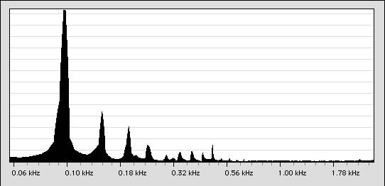

    利用以下参数, 

    ```matlab
    %% test
    a = 0.0001;
    d = 0.0001;
    s = 0.8;
    r = 0.99;
    harmonics = [1 0.35 0.23 0.12 0.04 0.08 0.08 0.08 0.12];
    wav = soundsong(140,'F',0,[1 4],fs,[a,d,s,r],harmonics);
    ```

    听起来有点像吉他! *吉他音的谐波分布与弹奏方式有较大关系*, 如`harmonics = [0.55 0.95 0.65 0.3 0.1]`也可以产生类似吉他音的效果, 这种情况下, `ADSR`包络参数对音色影响也较大.


## Show time!

```matlab
audiowrite('../wav/东方红.wav',soundsong(140,'F',0,ChinaRed,fs,adsr,harmonics),fs);
audiowrite('../wav/小苹果.wav',soundsong(180,'F',0,Apple,fs,adsr,harmonics),fs);
wav1 = soundsong(140,'D',-1,Hottest1,fs,adsr,harmonics);    
wav2 = soundsong(140,'E',0,Hottest2,fs,adsr,harmonics);     % 变调
audiowrite('../wav/最炫民族风.wav',[wav1,wav2],fs);
audiowrite('../wav/安静.wav',soundsong(70,'G',0,Quiet,fs,adsr,harmonics),fs);
audiowrite('../wav/Summer.wav',soundsong(140,'E',-1,Summer,fs,adsr,harmonics),fs);
audiowrite('../wav/菊花台.wav',soundsong(84,'F',0,Chrysanthemums,fs,[0.9 0.05 0.001 0.05],[1]),fs);
audiowrite('../wav/千本樱.wav',soundsong(154,'C',0,Senbonzakura,fs,[0.05 0.3 0.5 0.05],[1 0.4 0.8 0.9]),fs);
```

请君欣赏

|歌名|BPM|调|模仿乐器|
|:--:|:--:|:--:|:--:|
|[东方红](wav/东方红.wav)|140|F|钢琴|
|[小苹果](wav/小苹果.wav)|180|F|钢琴|
|[最炫民族风](wav/最炫民族风.wav)|140|<sup>♭</sup>D转E|钢琴|
|[安静](wav/安静.wav)|70|G|钢琴|
|[Summer](wav/Summer.wav)|140|<sup>♭</sup>E|钢琴|
|[菊花台](wav/菊花台.wav)|84|F|管乐|
|[千本樱](wav/千本樱.wav)|154|C|魔性的电子合成音|


# 分析音乐-中级

## 预处理(除去非线性谐波和噪声)

- 仔细分析`wave2proc`的时域波形

    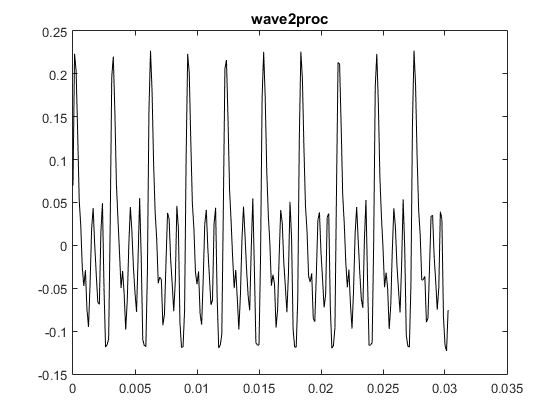

    大致有**十个周期**, 而`length(wave2proc)=243`, 利用`resample(wave2proc,250,243)`进行重采样, 使其长度成为10的倍数

    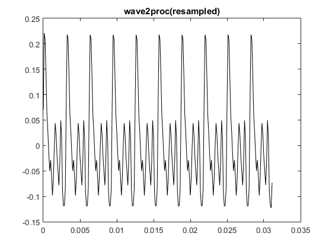

    从时域上看, 十个周期几乎完全一样, 要从原波形`realwave`得到上图波形, 可采用**平均去噪**的方法

    - 将`realwave`重采样, 使其长度变为250

        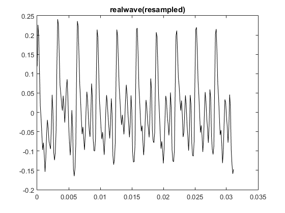

    - 对十个周期进行平均, 将得到的平均周期(长度为25)复制10份得到`resampled_wave2proc`

        ```matlab
        y = resample(realwave,250,243);
        A = reshape(y,25,10).';
        p = mean(A);
        resampled_wave2proc = repmat(p.',10,1);
        wav = resample(resampled_wave2proc,243,250);
        hold on;
        plot(t,wave2proc,'k');
        plot(t,wav,'r');
        ```

    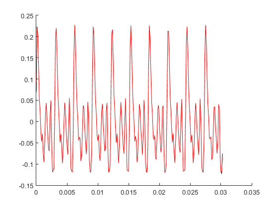

    由图像看出, 用以上方法得到的`wav`与`wave2proc`几乎一样, 于是将以上过程作为去除非线性谐波和噪声的预处理过程

- 预处理效果

    从频域对比`realwave`和`wave2proc`:

    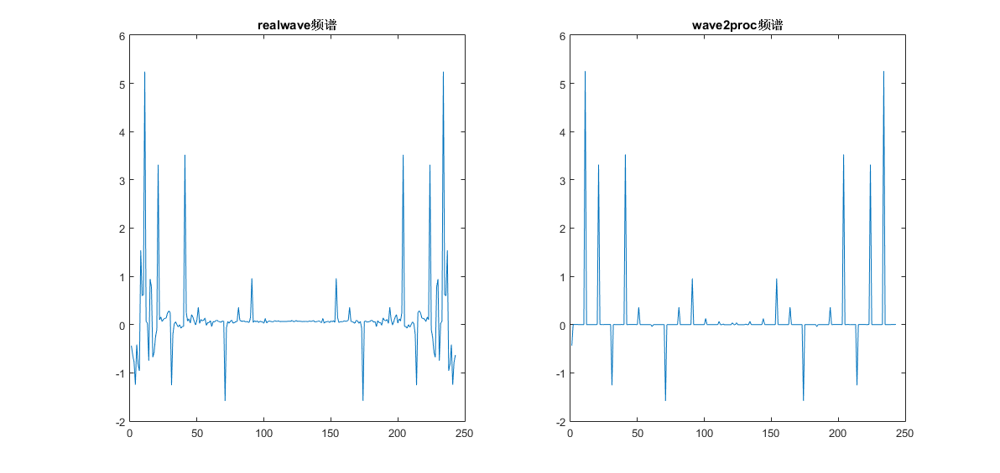

    可以看出, `wave2proc`的频谱比`realwave`少了非线性谐波和噪声的干扰, 使得音调特点更加突出.


## 基频分析

- 取出单周期信号分析

    ```matlab
    p = wave2proc(1:24);    % 近似地取出一个周期
    fft_plot(p,fs);         % 自定义fft_plot函数
    ```

    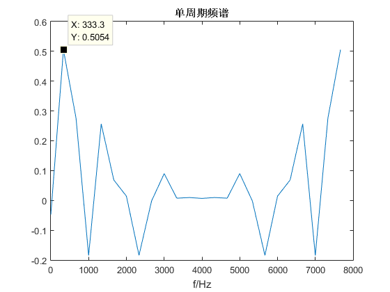

    **得到基频为333.3Hz, 这个频率介于C大调的Mi和Fa之间, 无法确定具体是哪个音**, 可见此法很不精确

- 对整个`wave2proc`分析

    ```matlab
    fft_plot(wave2proc,fs);
    ```

    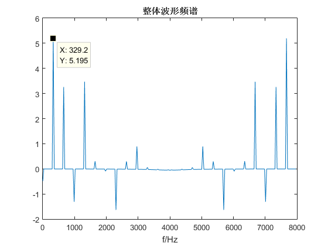

    **得到基频为329.2Hz, 基本可以确认这是C大调的Mi音(329.63Hz)**

- `wave2proc`重复100遍后分析

    ```matlab
    fft_plot(repmat(wave2proc,100,1),fs);
    ```

    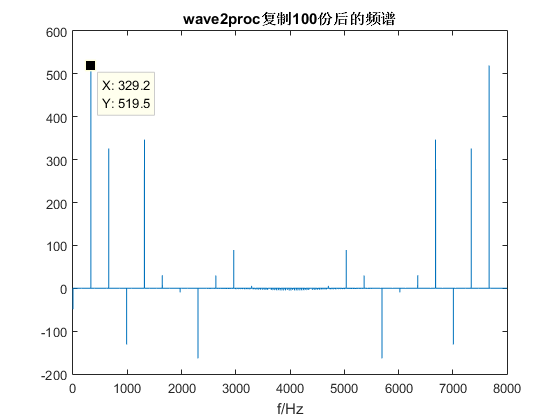

    **基频为329.2Hz, 结果与上一种方法相同, 频谱更接近冲激函数**

- 引用谷源涛老师*信号与系统*的讲义<sup>[3]</sup>, 当脉冲数增多直至趋于无穷, 即成为周期信号, **频谱由连续谱退化为离散谱**, 由分立的冲激函数构成

    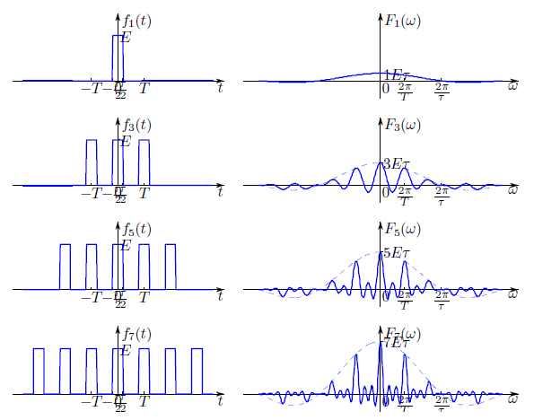
    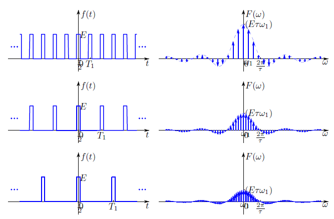


## 自动分析音乐

### 方法1 - 分段除噪

基于上一节中基频分析的方法, 用代码实现自动分析, 需要注意的是, 上一节中的`realwave`片段本身**具有较高的相似度**, 假设我们要分析的音乐也具有这样的特性, 不妨抽取一些片段来验证:

```matlab
r=randi(N,1,1),plot(fmt(r:r+249));  % 片段长度为250
```

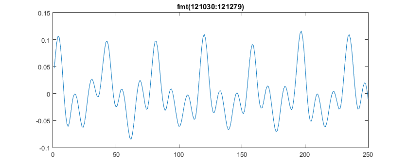
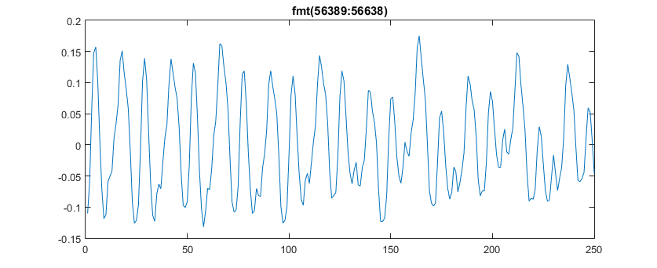
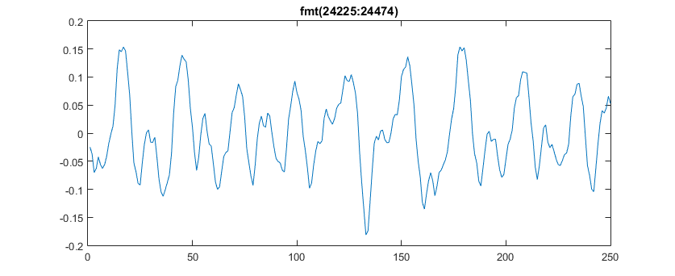
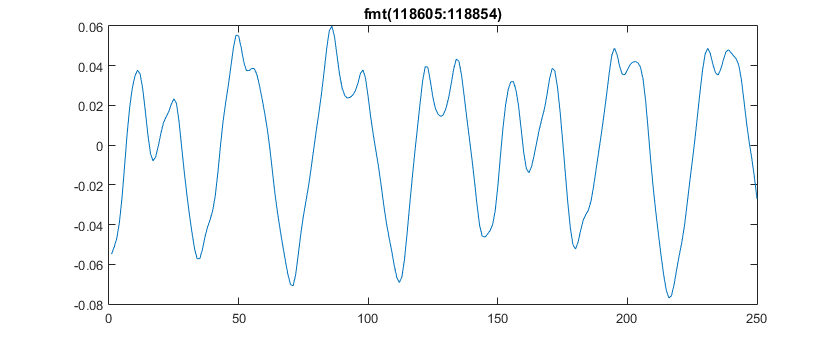

从上述抽样来看, 的确具有较高的**自相似性**

按一下步骤进行分析([src/analyzer.m](src/analyzer.m))

1. **除去乐曲开头和结尾的静音片段**

    由于不可能达到绝对的静音, 认为幅度小于阈值A<sub>th</sub>时即为无声;
    经测试, 取`Ath = 1e-3`(-60dB)

    ```matlab
    %% Delete mute slice
    Ath = 1e-3;                             % -60dB
    music_begin = find(fmt>Ath,1);          % 665
    music_stop = find(fmt>Ath,1,'last');    % 131049
    fmt = fmt(music_begin:music_stop);
    ```

    `fmt`长度由`131072`变为`130385`

2. **利用自相关函数确定重复周期**

    给定一个音乐片段`slice`(取长度`l=250`), 画出自相关函数, 可从极值点大致推测出周期长度

    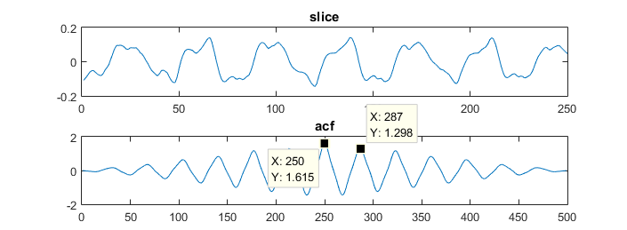

    代码无法从图像读取极值点, 采用差分方法找极大值:

    ```matlab
    N = length(slice);
    acf = xcorr(slice);     % auto corr function
    figure(1);
    subplot(2,1,1);plot(slice);title('slice');
    subplot(2,1,2);plot(acf);title('acf');
    maxs = find(diff(sign(diff(acf)))==-2)+1;   % find local maximums of acf
    period_length = maxs(find(maxs>N,1)) - N;   % estimate length of each period
    periods = ceil(N/period_length);    % estimate numbers of period
    ```

3. **预处理, 平均除噪**

    求得了片段的周期长度`period_length`和周期数`periods`, 可进行预处理, 即平均除噪

    - 先对`slice`重采样

        ```matlab
        %% preprocess
        y = resample(slice,periods*period_length,N);
        ```

        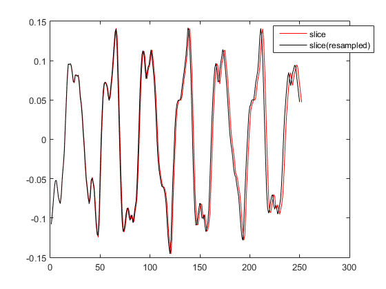

    - 平均除噪

        ```matlab
        A = reshape(y,period_length,periods).';
        p = mean(A).';
        w = repmat(p,periods,1);
        w = resample(w,N,periods*period_length);
        ```

        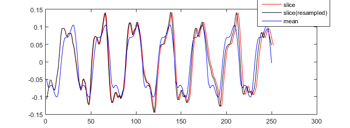

4. **提取强频率分量**

    先从直观上感受一下经预处理后频谱的变化:

    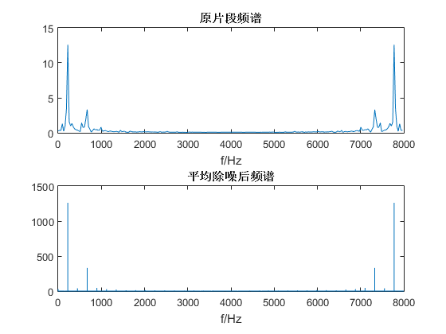

    **平均除噪后的频谱是先将波形重复了100次后再绘制的, 接近冲激函数**

    设定频谱能量阈值`E=100`(因为重复了100次, 频谱能量也会倍乘100), 将能量高的分量筛选出来

    ```matlab
    E = 100;                % threshold of E
    f = find(y>E)*fs/N/100; % pick out powerful frequency
    f = f(1:end/2);         % delete symmetry elements
    ```

    对于测试的`slice`, 提取结果为`f = [224.3200;672.3200]`

5. **从强频率分量中分析出基频分量**

    由于可能有多个基频分量, 故不能简单地取出`f`的第一个元素作为基频分量, 因此用以下算法分析基频分量:

    **对f中的元素遍历, 若该元素大约是其他元素的整数倍, 则不是基频分量, 遍历完剩下的即基频分量**

    由于人耳识别振动频率的能力大约在±0.5%<sup>[4]</sup>, 对整数倍的判定定为误差在0.5%以内

    ```matlab
    %% detect fundamental frequency
    fundamental = [];
    for i = 1:length(f)
        if isempty(fundamental)
            fundamental = [fundamental,f(i)];
        else
            ratio = f(i)./fundamental;
            inrange = (ratio<(round(ratio)*1.005)) + (ratio>(round(ratio)*0.995));
            if all(inrange~=2)
                fundamental = [fundamental,f(i)];
            end
        end
    end
    ```

**基本过程如上, 我们来看一下效果**

```matlab
%% Read wav from file
fmt = wavread('G:\Vone\Tsinghua\2015summer\matlab\音乐合成\音乐合成所需资源\fmt.wav');
fs = 8000;

%% Delete mute slice
Ath = 1e-3;         % -60dB
music_begin = find(fmt>Ath,1);
music_stop = find(fmt>Ath,1,'last');
fmt = fmt(music_begin:music_stop);

%% Processing slices
l = 200;    % length of each slice
note = [];
for i = 1:floor(length(fmt)/l)
    note = [note,detect_fundamental_f(fmt((i-1)*l+1:i*l),fs)];
end
```

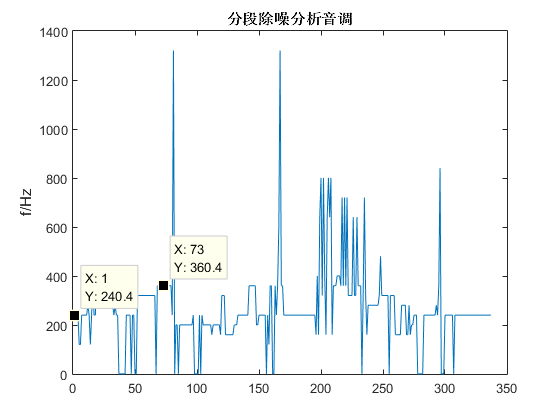

任取两个点, 分析出的基频频率都找不到对应的音(误差太大), 这是为何呢? 笔者仔细研究后发现, 问题出在利用**自相关函数**自动确定周期的部分, 对于下图这个片段

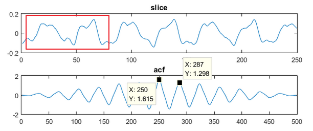

把红色部分视为一个周期似乎更准确, 而自相关函数的峰值很难分辨出这样细微的区别;

另外, 在平均化的过程中, 不只是噪声被削弱了, **音乐本身的乐音特点可能也会被去除**;

因此这个方法分析出的音调相当不准确, 也很难改进, 下面采用**时频分析**的方法来确定音调, 效果明显好得多.

### 方法2 - 时频分析

受CoolEdit中时频图的启发(下图), 可以直接利用`spectrogram`函数方便地进行**分段短时傅里叶变换并整合分析**, 这种方法的好处在于**不需要手动标定每个音开始的时刻**, 时频图会告诉我们答案

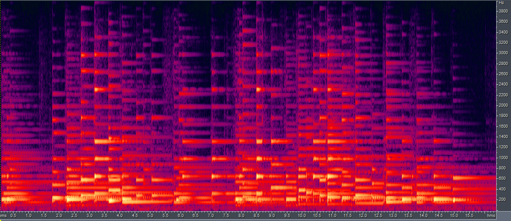

绘制时频图如下

```matlab
%% Spectrogram and plot
[S,F,T,P] = spectrogram(fmt, 2048, 2000, 4000, fs);

figure(1);
surf(T,F,10*log10(P),'edgecolor','none');
view(0,90);title('时频分析');xlabel('t/s');ylabel('f/Hz');
axis([0 16 0 4000]);
```

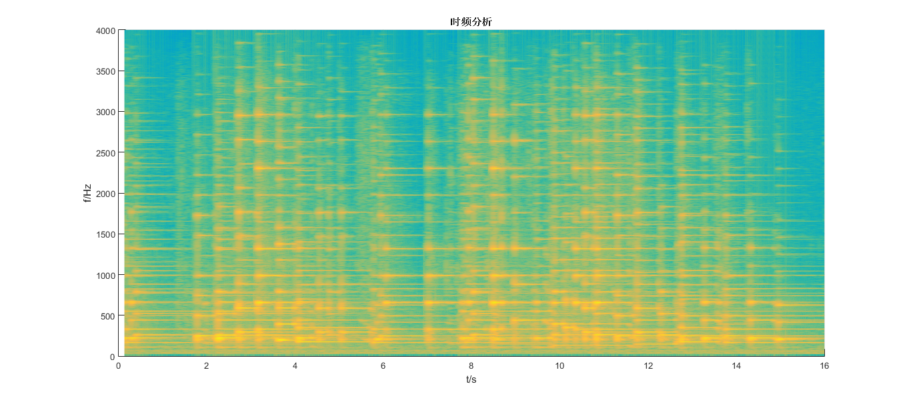

`spectrogram`函数返回的`F,T,P`分别代表**频率序列**,**时间序列**以及**在某时刻某个频点附近的功率大小**, 

调用`spectrogram`时取`NFFT=4000`, 这决定了频率序列的间隔大小为`fs/NFFT=2Hz`, 这个分辨率足以分辨音乐的曲调(因为较低的相邻两音之间频率差也在10Hz左右) .

于是, 按一下步骤分析音调([src/analyzer2.m](src/analyzer2.m))

1. **按功率强弱对各时刻的频率分量排序**

    ```matlab
    %% Sort
    [sortP,I] = sort(P,'descend');
    sortf = F(I);   % column j of sortf is descend-sorted frequency at time T(j)
    ```

    则`sortf`每一列自上到下是当前列所对应时刻频率分量从强到弱的排序, 各频率分量的功率在`sortP`的对应位置

    这里再次涉及到功率阈值的问题, 利用`sort(sortP,2,'ascend')`观察可知, 将频域功率阈值设定为`Pth=1e-5`(-50dB)较为合理

2. **对各时刻达到阈值的频率分量进行处理**

    处理包括: **合并**, **检出基频**

    我们不妨将第一列达到阈值的频率分量取出

    ```matlab
    >> sortf(find(sortP(:,1)>Pth))

    ans =

       220
       222
       218
       224
       216
       226
       214
       662
       212
       660
       228
       664
       658
       202
       204
       210
       666
       334
       200
       332
    ```

    可见效果不理想, 因为实际上基频为220Hz, 但由于阈值太低, 使得207.65Hz附近的频率分量也被提取出来了, 这样会对辨认音调造成影响, 因此采用**梯度阈值筛选**的方法

    即`Pth1=1e-4; Pth2=1e-5`, 先按`Pth1`筛选, 若阈值太高没有频率分量达到阈值, 再降低至`Pth2`筛选

    ```matlab
    sortf(find(sortP(:,1)>Pth1))

    ans =

       220
       222
       218
       224
       216
    ```

    


# 参考文献

[1] [Logic Pro 9 乐器_ 减法合成器的工作原理](http://help.apple.com/logicpro/mac/9.1.6/cn/logicpro/instruments/index.html#chapter=A%26section=3%26tasks=true), viewed on 2015/7/23

[2] [Computer Music_ Guitar Spectrum](http://computermusicresource.com/guitar.spectrum.html), viewed on 2015/7/24

[3] 谷源涛, *2015春信号与系统09第八讲3.9-3.12(18)*, 2015

[4] 谷源涛等, *信号与系统-MATLAB综合实验(71)*, 2010
