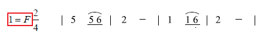
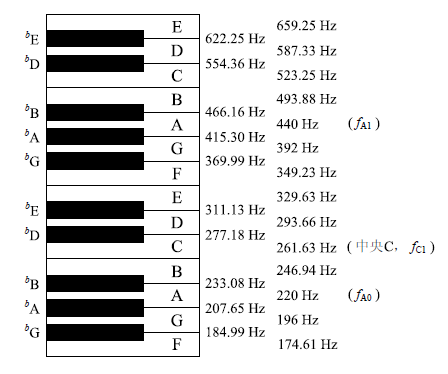
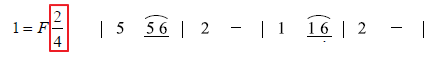
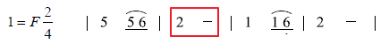
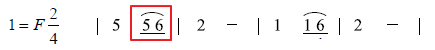
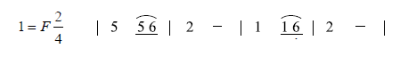
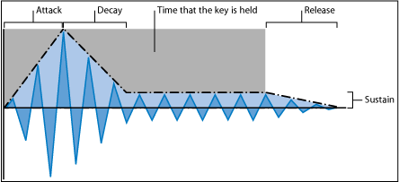
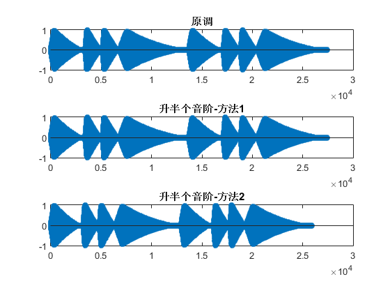

# music-synthesizer
Homework No.1 for summer course: MATLAB

# 音乐合成

## 简谱入门

### 定调



以上图为例, `1=F`表示该歌曲为**F调**, 根据下图音名与频率的对应关系, 



可知该简谱中各唱名对应的音名及频率如下表: 

|唱名|音名|频率(Hz)|频率变化(f<sub>i</sub>/f<sub>i-1</sub>)|
|:--:|:--:|:--:|:--:|
|1|F|349.23|/|
|2|G|392.00|1.1225|
|3|A|440.00|1.1225|
|4|<sup>♭</sup>B or <sup>♯</sup>A|466.16|1.0595|
|5|C|523.25|1.1225|
|6|D|587.33|1.1225|
|7|E|659.26|1.1225|
|高音1|F|698.46|1.0595|

对应时要注意3和4, 7和高音1之间是**半音**关系, 即频率比例为2<sup>1/12</sup>, 其余相邻音之间为全音关系, 即频率比例为2<sup>2/12</sup>

另外注意到高音1的频率是1频率的两倍, 即高了一个八度.

- 创建`src/freqmap.m`函数实现计算给定调给定音频率的功能

    ```matlab
    >> help freqmap
      freqmap(key, nnote)
      输入:
      <string> key: 调名
      <int> nnote: 数字简谱
      返回值:
      <float> f: 该音在给定调下的频率
     
      e.g. 求 F大调 So(5)音 的频率
      freqmap('F',5)
                = 523.2511
     
      
      freqmap(key, nnote, flag)
      输入:
      <int> flag: -1表示降调(b), 1表示升调(#)
     
      e.g. 求 bD调 La(6)音 的频率
      freqmap('D',6,-1)
                = 466.1638
    ```

    ```matlab
    >> freqmap('F',1)  % 求F调Do的频率

    ans =

      349.2282
    ```

    - *注: 输入参数nnote=0表示低音7, 而非休止符, 输入参数nnote=8表示高音1, 以此类推*


### 节拍, 时值, 停顿

#### 节拍

- `BPM`: Beats Per Minute, 歌曲每分钟的节拍数, 歌曲*东方红*的`BPM=140`, 因此一拍的时间大约为`60/140=0.43`秒

- 节奏: 分母`m`表示以一个`m`分音符为一拍, 分子`n`表示一小节有`n`拍

    

    如东方红为四二拍, 一个四分音符为一拍, 一小节两拍

#### 时值(音符的持续时间)

- 增时线: 时值增加一拍

    

    上图中的2音持续两拍

- 减时线: 时值减半

    

    上图中的5和6的时值均为半拍

- 附点: 时值增加原来的一半, 即时值*1.5

#### 停顿

- 简谱中用0表示休止符, 即无声的音符, 其时值规则同上


## 用数据表示简谱



```matlab
BPM = 140;
key = 'F';
song = [5, 1;       % 将一段乐谱表示为一个n-by-2矩阵
        5, 0.5;     % 第一列表示各音符的唱名
        6, 0.5;     % 注意0表示低音7, -1表示低音6, 以此类推
        2, 2;       % 休止符用-inf表示
        1, 1;       % 第二列表示各音符的时值, 单位为拍
        1, 0.5;
        -1, 0.5;
        2, 2];
```

- 给定了简谱的数据结构, 构建`src/soundsong.m`进行**初级音乐合成**

    ```matlab
    % src/soundsong.m

    function wav = soundsong(BPM,key,flag,song,fs)
    % soundsong(BPM,key,song,fs)
    % 输入:
    %   <float> BPM: beats per minute
    %   <char> key: 歌曲的调
    %   <int> flag: -1表示降半个音阶(♭), 1表示升半个音阶(♯)
    %   <n-by-2 matrix> song: 乐谱, 第一列为音符唱名, 第二列为各音符持续拍数
    %       休止符用-inf表示
    %   <float> fs: 采样频率
    % 返回值:
    %   <row vector> wav: 合成的歌曲

    tpb = 60/BPM;   % time per beat (seconds)
    wav = [];       % intialize wav
    for i = 1:size(song,1)
        t = 0:1/fs:(tpb*song(i,2));     % time sequence
        if song(i,1) == -inf
            wav = [wav, zeros(1,length(t))];
        else
            wav = [wav, sin(2*pi*freqmap(key,song(i,1),flag)*t)];
        end
    end

    sound(wav,fs);

    end
    ```

    ```matlab
    >> soundsong(140,'F',0,song,fs);
    >> soundsong(120,'F',0,song,fs);
    >> soundsong(120,'C',0,song,fs);
    ```

    如上, 即可用单频信号合成音乐, 可以调节节奏快慢, 基调

    **注: 将`soundsong.m`中的`sin`函数换成`sawtooth`, `square`等函数会听到不同音色的音乐, 因为锯齿波和方波含有不同的谐波分量, 改变了音色**


## ADSR包络控制<sup>[1]</sup>



- 起音(Attack): 控制最初从零振幅到最大振幅的时间

- 衰减(Decay): 控制从最大振幅降到延音电平的时间

- 延音(Sustain): 设定按住某个键时生成的稳定振幅电平(延音电平)

- 释音(Release): 控制键释放后, 从延音电平降至零振幅的时间

*注: 如果在起音或衰减阶段释放键，则通常会跳过延音阶段。延音电平为零会产生类似钢琴声或打击乐的包络，没有持续稳定的电平，即使按住键时也如此。*

**根据人耳特性, 采用指数衰减的包络进行调制**

```matlab
function wav = adsr(attack,decay,sustain,release,wavin,t)
%wav = adsr(attack,decay,sustain,release,generator,t)
% 输入:
%   <float> attack: 冲激时间所占比例
%   <float> decay: 衰减时间所占比例
%   <float> sustain: 延音电平归一化振幅(最大振幅为1)
%   <float> release: 释放时间所占比例
%   <string> generator: 'sin', 'sawtooth', 'square'
%   <row vector> t: 时间序列
%   <float> f: 频率
% 返回值:
%   <row vector> wav: 包络调制后的波形

N = length(t);
ta = t(1:floor(attack*N));     % time sequence for Attack
td = t(floor(attack*N)+1:floor((attack+decay)*N));    % time sequence for Decay
tr = t(floor((1-release)*N)+1:end);    % time sequence for Release

wa = wavin(1:floor(attack*N));
wd = wavin(floor(attack*N)+1:floor((attack+decay)*N));
ws = wavin(floor((attack+decay)*N)+1:floor((1-release)*N));
wr = wavin(floor((1-release)*N)+1:end);

ea = exp(ta/ta(end))/exp(1);    % envelope for Attack
ed = exp(1-(td-td(1))/(td(end)-td(1))*(1-sustain))/exp(1);  % envelope for Decay
es = exp(sustain)/exp(1);            % envelope for Sustain
er = exp(sustain-(tr-tr(1))/(tr(end)-tr(1))*sustain)/exp(1);    % envelope for Release

wav = [ea.*wa, ed.*wd, es.*ws, er.*wr];

end
```

即将输入音乐分段调制后再输出, 包络形状由ADSR四个参数控制, 对于单频信号, ADSR对其音色的影响如下:

|起音A|衰减D|延音S|释放R|音色|
|:---:|:---:|:---:|:---:|:--:|
|0.9|0.05|0|0.05|类笛子|
|0.05|0.9|0|0.05|钢琴|
|0.05|0.05|0|0.9|电话按键音|
|0.05|0.05|0.1|0.9|拨弦音|
|0.001|0.001|0|0.001|鼓点|


## 变调

- 升一个八度

    - 方法一: **改谱子**

        将原谱中的每个音提高一个八度, 对应到矩阵中即第一列的元素+7, 第二列保持不变: 

        ```matlab
        >> ChinaRed

        ChinaRed =

            5.0000    1.0000
            5.0000    0.5000
            6.0000    0.5000
            2.0000    2.0000
            1.0000    1.0000
            1.0000    0.5000
           -1.0000    0.5000
            2.0000    2.0000

        >> HighChinaRed = [ChinaRed(:,1)+7,ChinaRed(:,2)]

        HighChinaRed =

           12.0000    1.0000
           12.0000    0.5000
           13.0000    0.5000
            9.0000    2.0000
            8.0000    1.0000
            8.0000    0.5000
            6.0000    0.5000
            9.0000    2.0000

        >> wav = soundsong(140,'F',0,ChinaRed,fs,adsr);         % 原调
        >> wav1 = soundsong(140,'F',0,HighChinaRed,fs,adsr);    % 升一个八度
        ```

    - 方法二: **重新采样**

        升高一个八度即将频率变为原来的两倍, 可用`resample`函数将采样率降为原来的一半, 再以原采样率调用`sound`, 频率即变为原来的两倍, 但音乐的时长会变化

        ```matlab
        >> wav2 = resample(wav,1,2);
        >> sound(wav2,fs);
        ```

    - 对比两种方法, 产生的音乐音调相同, 但方法二产生的音乐在时间上被压缩了

- 降一个八度

    - 方法一: **改谱子**

        ```matlab
        >> LowChinaRed = [ChinaRed(:,1)-7,ChinaRed(:,2)];
        >> wav1 = soundsong(140,'F',0,LowChinaRed,fs,adsr);
        ```

    - 方法二: **重新采样**

        ```matlab
        >> wav2 = interp(wav,2);    % 以原采样率的两倍重新进行线性插值采样
        >> sound(wav2,fs);
        ```

    - 两方法音调相同, 但方法二产生的音乐在时间上被拉长了

- 升半个音阶

    - 方法一: **改曲调**

        注意到`soundsong`函数提供了`flag`参数用以调整音阶, F调升半个音阶成为<sup>♯</sup>F调(<sup>♭</sup>G调)

        ```matlab
        >> wav1 = soundsong(140,'F',1,ChinaRed,fs,adsr);
        >> wav1 = soundsong(140,'G',-1,ChinaRed,fs,adsr);   % 两句等价
        ```

    - 方法二: **重新采样**

        升半个音阶频率倍乘系数为2<sup>1/12</sup>, 利用`resample`函数

        ```matlab
        >> rats(2^(1/12))   % 用分数表示倍乘系数

        ans =

           1657/1564  

        >> wav2 = resample(wav,1564,1657);
        >> sound(wav2,fs);
        ```

    - 两种方法生成的音乐曲调人耳无法分辨出不同, 时长略有不同, 人耳难以察觉

        


# 参考文献

[1] [Logic Pro 9 乐器_ 减法合成器的工作原理](http://help.apple.com/logicpro/mac/9.1.6/cn/logicpro/instruments/index.html#chapter=A%26section=3%26tasks=true), viewed on 2015.7.23
